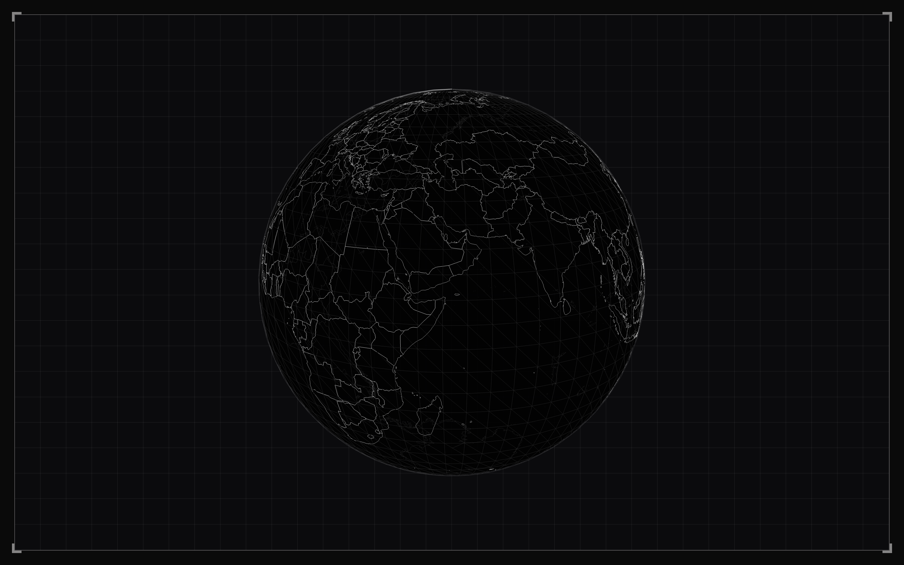

# 🌍 Jahnny Globe: The Ultimate Travel Archive



A premium, interactive 3D globe visualization developed as a passion project for my favorite YouTuber and vlogger, **@jahnnyVLOGS**. This application archives and showcases Jahnny's global travels, combining high-performance 3D rendering with a sleek cyberpunk aesthetic to provide an immersive journey through captured memories across the world.

## 🚀 Vision
Jahnny Globe isn't just a map; it's a digital secondary brain for travel records. It serves as a high-tech terminal to access vlog archives, tracking every milestone from the vibrant streets of South Korea to the majestic landscapes of Ethiopia.

## ✨ Key Features
- **Interactive 3D Exploration**: A high-fidelity globe with smooth OrbitControls and atmospheric glow.
- **Jahnny's Trail**: Visited countries are highlighted with a signature **Neon Green** solid fill (and a special **Royal Blue** for Ethiopia).
- **Vlog Integration**: Click any visited country to slide out a glassmorphic drawer containing curated YouTube vlogs for that region.
- **Cyberpunk UI**: Modern, glassmorphic overlays with scanning animations and monospace typography.
- **Triple-Layer Glow**: Optimized line segments with multi-layered atmospheric glows for a premium "hacker terminal" look.
- **Mobile Optimized**: Responsive design that adapts the 3D canvas and UI for a seamless experience on any device.

## 🛠️ Technology Stack
- **[Next.js 16.2.3](https://nextjs.org/)**: The latest in React framework technology, utilizing Turbopack for lightning-fast development.
- **[React Three Fiber](https://r3f.docs.pmnd.rs/)**: A powerful React reconciler for Three.js.
- **[Tailwind CSS v4](https://tailwindcss.com/)**: Cutting-edge utility-first styling for the modern web.
- **[Three.js](https://threejs.org/)**: The industry-standard 3D engine.
- **[Vercel Analytics](https://vercel.com/analytics)**: Integrated tracking for global visitor metrics.
- **Custom Geometry Pipeline**: Merged buffer geometries and Canvas-based textures for 60FPS performance even with complex GeoJSON data.

## 📐 Engineering Highlights
- **Mathematical Selection**: Instead of heavy raycasting against thousands of meshes, Jahnny Globe uses optimized **Point-in-Polygon** math to detect country clicks in milliseconds.
- **Concave Hull Mapping**: Implements a high-resolution Canvas Texture mapping system to ensure flawless fills for complex landmasses like Indonesia and the UK.
- **SSR Safety**: Utilizes dynamic imports with disabled SSR to ensure stability during the Next.js production build process.
- **Memory Management**: Full disposal cycles for geometries and textures to prevent memory leaks in long-running sessions.

## 📂 Project Structure
```text
├── app/               # Next.js App Router (Layouts, Pages, Globals)
├── components/        # React Components
│   └── globe/         # 3D Globe, VlogDrawer, and UI overlays
├── lib/               # Utilities (Geo-math, Constants, Design Tokens)
├── public/            # Static assets (GeoJSON, Icons, Screenshots)
└── types/             # TypeScript definitions
```

## 🚀 Getting Started

1. **Clone the repository**:
   ```bash
   git clone https://github.com/yoseflakew25/jhanny-globe.git
   ```

2. **Install dependencies**:
   ```bash
   npm install
   ```

3. **Run the development server**:
   ```bash
   npm run dev
   ```

4. **Build for production**:
   ```bash
   npm run build
   ```

## 📜 Credits
Developed with ❤️ by **[Yosef Lakew](https://github.com/yoseflakew25)** as a dedication to his favorite YouTuber and vlogger, **[JahnnyVLOGS](https://www.youtube.com/@jahnnyvlogs)**. 

Special thanks to Jahnny for the constant inspiration and incredible travel content that made this project possible.

---
*Created as part of the JahnnyVLOGS Global Archival System.*